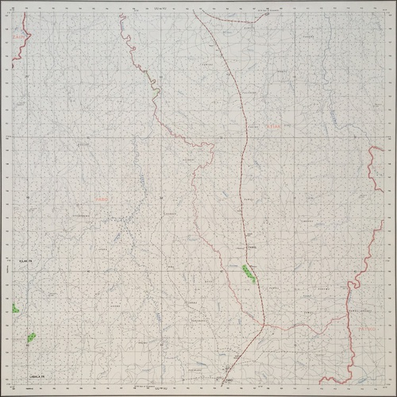

# huckathon-autogeoref

This is a workflow that I used to automatically create [this continuous slippy map from a collection of 144 1960's map sheets](http://huckg.is/uganda50k) using computer vision. iFrames are not allowed in readme files, or I would put the demo here here is a static image instead, click it to see the real one:

The map is composed of photographs of 144 map sheets. The images were corrected for barrel distortion using [ImageMagick](https://www.imagemagick.org/script/index.php) and the map frames were automatically detected in the image using the map using [OpenCV](https://opencv.org/):

The frames were then extracted and corrected for perspective distortion:

and then cropped to remove the border:

finally, the software uses [GDAL](http://www.gdal.org/) to georeference the files, mosaic into a VRT and then cut into tiles to be served to the [leaflet](https://leafletjs.com/) map above. Colour balancing is attempted using [rastrio](https://rasterio.readthedocs.io/en/latest/).

---

## Usage and Dependencies

This code is only intended to demonstrate the workflow that I used, it is designed for the particular map collection that I was working with and not for ease of transferability. That said, I would expect that it would be quite simple to apply it to other map collections. To use this for your own map collection, you would probably need to do little more than edit the barrel distortion values for your camera lens / focal length and edit the `gridToCoords()` function, which is used to work out the coordinates for the image based upon the file name (which described the grid square in my case). You might need to adjust the parameters in some of the computer vision and image processing functions (particularly the crop size, for example), but this should be quite easy to achieve through trial and error.

To actually run the software, simply run `run.sh` in the terminal.

These are the dependencies upon which the software is built:

* [ImageMagick CLI](https://www.imagemagick.org/script/index.php)
* [OpenCV (cv2) Python bindings](https://opencv.org/)
* [GDAL Python bindings](http://www.gdal.org/) 
* [GDAL CLI](http://www.gdal.org/)
* [rasterio CLI](https://rasterio.readthedocs.io/en/latest/)

## Maps
The demo images are out-of-copyright images or Northern Uganda produced by the Ordnance Survey in the 1960's. The maps were supplied courtesy of University of Manchester Library Special Collections.

## Acknowledgements
Grateful thanks to Donna Sherman for organising access to the maps and to Nick Scarle for taking and pre-processing the photographs *(and getting a very sore arm in the process!)*.