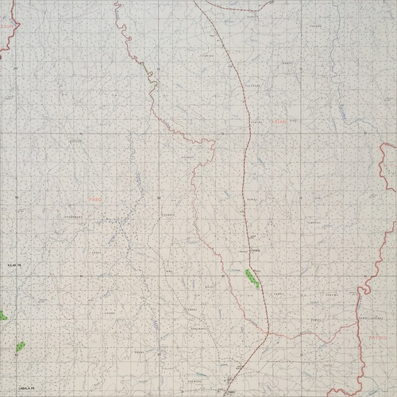

# huckathon-autogeoref

This is a workflow that I used to automatically create this map using computer vision:

<iframe width=800px height=500px src="http://huckg.is/uganda50k"></iframe>

The map is composed of photographs of approximately 124 map sheets. The images were corrected for barral distortion using [ImageMagick](https://www.imagemagick.org/script/index.php) and the maps frames were automatically detected using the map using [OpenCV](https://opencv.org/), like this:

extracts it (correcting for perspective distortion):

crops it:

and then uses [GDAL](http://www.gdal.org/) to georeference the files, mosaic into a VRT and then cut into tiles to be served to the [leaflet](https://leafletjs.com/) map above. Colour balancing is attempted using [rastrio](https://rasterio.readthedocs.io/en/latest/).

---

## Usage and Dependencies

This code is only intended to demonstrate the workflow that I did, it is designed for the particular map collection that I was working with,  and not for ease of transferability. That said, I would expect that it would be quite simple to apply it to other map collections.

To use this for your own map collection, you would need to edit the code a little, in particular the barrel distortion values for your camera lens and the `gridToCoords()` function, which is used to work out the coordinates for the image based upon the file name. You might need to adjust the parameters in several of the computer vision functions, though this is best achieved through trial and error.

To actually ruhn the software, simply run `run.sh` in the terminal.

These are the dependencies upon which the software is built:

* [ImageMagick CLI](https://www.imagemagick.org/script/index.php)
* [OpenCV (cv2) Python bindings](https://opencv.org/)
* [GDAL Python bindings](http://www.gdal.org/) 
* [GDAL CLI](http://www.gdal.org/)
* [rasterio CLI](https://rasterio.readthedocs.io/en/latest/)

## Maps
The demo images are out-of-copyright images or Northern Uganda produced by the Ordnance Survey in the 1960's. Maps supplied courtesy of University of Manchester Library Special Collections.

## Acknowledgements
Grateful thanks to Donna Sherman for organising access to the maps and to Nick Scarle for taking and pre-processing the photographs *(and getting a very sore arm in the process!)*.